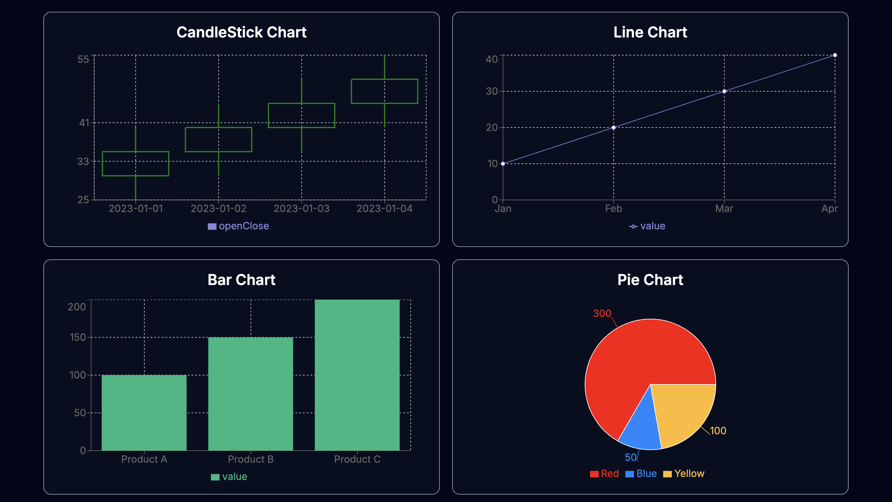

# How to set up the application

## Django Backend

1) First, download, unzip, and <i>open</i> my Django backend:
    * `cd charts_backend` 
2) Once inside, create a venv:
    * `python -m venv venv`
    * `python3 -m venv venv` (if the python does not work)
3) Then, activate my venv:
    * `source venv/bin/activate` -> mac
    * `.\venv\Scripts\activate` -> windows
4) Once the venv is activated, install the files in requirements.txt:
    * `pip install -r requirements.txt`
5) Run the webserver:
    * `python manage.py runserver`
* <i> Ensure you have the backend running on localhost:8000. </i> 
## Next.js Frontend

1) First, download, unzip, <i>open</i> my Next.js backend:
    * `cd charts_frontend`
2) Install all necessary dependencies:
    * `npm install`
3) Run the frontend:
    * `npm run dev`
 * <i> Ensure you have the frontend running on localhost:3000. </i>
# Any libraries or tools used

1) I used the following Django tools/libraries:
    * rest_framework
        * Used to implement the Rest API.  
    * corsheaders 
        * Used to allow the frontend and backend to be run without the requests being blocked. 
2) I used the following Next.js tools/libraries:
    * recharts
        * Used to create the charts with the API data.
    * tailwindcss
        * Used to style the frontend. 

# Explanation of the approach and thought process
- First, I started the project by creating the Backend and formatting the API requests. I made sure that the data portion of the assignment was completed first to ensure future simplicity. Going deeper, I made sure I was using the correct CRUD operation and that there would be no problems transferring the data from the Django backend. Then, I added unit tests and tested the API. 
- Going to the front end, I first created the components I needed. I did not add any functionality, just the fetch. This was to test the connection between the front end and the back end. Then, I created 4 empty default components, to replace with the graphs later. After this, I started working on understanding the recharts library. I read over the documentation and the resources and started to complete the bar chart graph. After that was finished, I confirmed that it looked correct and moved on to complete the line graph and pie chart. All 3 of these components were very similar, allowing for a simple procedure. The candlestick chart was a little bit different. I had to leverage my previous experience and documentation to understand how to candlestick from rechart. Unlike the other components, Recharts do not have a candlesticks graph component. This made creating the candlestick a little bit challenging as I would have to create the candlestick graph from formulas. Once all of the graphs were completed. I ensured that the styling was correct to correctly effectively, and dynamically show the graphs.   

# Demo 

*Screenshot of the home page interface.*